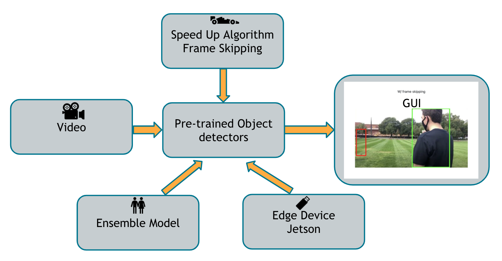

# Object detection on the edge
*CS6220 Big Data Systems and Analytics Final Project, Gatech*

The project focuses on speeding up objection detection and improving accuracy through frame-skipping strategies and ensemble methods. An interactive webpage is built for visualize the results in realtime. The code is deployed to an edge device called Jetson Nano for testing. We constructed a new test dataset [here](https://drive.google.com/drive/folders/1h-TueDG_UWBQgoRhhbBoqFT5XFsb4Ti7?usp=sharing). Check out our demo video [here](https://drive.google.com/file/d/1l6e0qfJ5t5B4aDBSjUOChh4bPue4dWJC/view?usp=sharing).

## Structure

The structure of our project is shown as above. The pre-trained object detectors can be found [here](https://github.com/khchow-gt/object-detection-zoo) and the pre-trained weights can be found [here](https://www.dropbox.com/s/vhhnp3wt4oztkqz/model_weights.zip?dl=0). We implemented code for a frame-skipping strategy component, a ensemble component, a [Jetson Nano component](./jetson-nano) and 
a [web application component](./objdect).

## Frame Skipping: Boosting Tracker

Colab for frame skipping in the setting of combining boosting tracker and YOLO MobileNet (optional as we later convert the jupternotebook into local python file to run all experiments)

### How to run
1. download all the files in this [google drive link](https://drive.google.com/drive/folders/1mR1U6gVOxfXT8w__yRZB-nsBTibKDh8G?usp=sharing) to your google drive.

2. run demo_v1_1.ipynb. First, mount your system to your drive. Second, pip install the packages in the code segment. Third, restart Runtime.

3. Run the left code blocks sequentially until second last block. Go to output directory and create a directory yolov3mobile${fps}  (e.g. yolov3mobile10)

4. In the last block, set the fps you want and then run it.

5. The results will be in output/yolov3mobile{fps} directory in your google drive.

## WEB visualization
### Environment Setup
Create virtual environment for both Python and Javascript.
```
./bin/objdectInstall
```

### How to run
Compile the JS code, and launch the backend server,
```
$ ./bin/objdectRun
```
Navigate to `localhost:8000` and play with the web!


## Contributors
*ordered according to the last name*

Aslihan Celik\
Connor Guerin\
Tienchi Hsin\
Ming Ying Li\
Yuyi Qu
